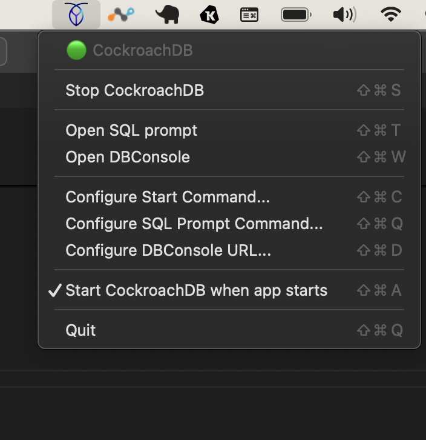

# CRDB Launcher for MacOS

Simple MacOS menu utility to run CockroachDB locally.



## Build

### Requirements

Requires Python3.8 from <https://www.python.org/downloads/>.

```bash
pip3.8 install -U pip
pip3.8 install rumps py2app applescript

brew install create-dmg
```

### Test and Build

Test locally without building

```bash
python3.8 CRDB_Launcher.py
```

Build App

```bash
rm -rf build dist && python3.8 setup.py py2app
```

Test App by starting it from the terminal

```bash
dist/CRDB_Launcher.app/Contents/MacOS/CRDB_Launcher 
```

Build DMG file

```bash
# https://github.com/create-dmg/create-dmg

rm -rf CRDB_Launcher.dmg && create-dmg \
  --volname "CRDB_launcher Installer" \
  --volicon "icon.icns" \
  --window-pos 100 120 \
  --window-size 800 400 \
  --icon-size 100 \
  --app-drop-link 100 100 \
  "CRDB_Launcher.dmg" \
  "dist/"
```
